# Email Integration with IntakeAgent

This document explains how the Gmail IMAP email monitoring has been integrated into the IntakeAgent pipeline.

## 🎯 Overview

The IntakeAgent now supports **optional** background email monitoring that:
- 📬 Monitors Gmail via IMAP (no OAuth required)
- 📄 Parses incoming emails (subject, body, sender)
- 📡 Sends parsed emails to webhook endpoint `/webhooks/gmail/simple`
- 🤖 Processes emails through the full IntakeAgent pipeline
- 🎫 Creates tickets automatically from emails

## ✅ Key Features

- **✅ Backward Compatible**: Existing code works unchanged
- **✅ Optional**: Email monitoring is disabled by default
- **✅ Background Processing**: Runs in separate thread, doesn't block main app
- **✅ Graceful Failure**: Continues working if email setup fails
- **✅ Dynamic Control**: Start/stop monitoring at runtime
- **✅ Robust Error Handling**: Automatic reconnection and retry logic
- **✅ Structured Logging**: All operations use proper logging
- **✅ Cross-Platform**: Works on Windows and Linux

## 🚀 Quick Start

### 1. Basic Usage (No Email)
```python
from src.agents.intake_agent import IntakeClassificationAgent

# Works exactly like before - no changes needed
agent = IntakeClassificationAgent()
```

### 2. Enable Email Monitoring
```python
# Enable email monitoring during initialization
agent = IntakeClassificationAgent(
    enable_email_monitoring=True,
    webhook_url="http://localhost:8001/webhooks/gmail/simple",
    email_check_interval=30  # Check every 30 seconds
)
```

### 3. Dynamic Control
```python
# Start without email monitoring
agent = IntakeClassificationAgent()

# Start email monitoring later
agent.start_email_monitoring()

# Check status
status = agent.get_email_monitoring_status()
print(f"Email monitoring active: {status['is_monitoring']}")

# Stop monitoring
agent.stop_email_monitoring()
```

## 📧 Email Setup Requirements

### Gmail App Password Setup
1. **Enable 2-Factor Authentication** on your Gmail account
2. **Generate App Password**:
   - Go to: https://myaccount.google.com/apppasswords
   - Select app: "Mail"
   - Select device: "Other (custom name)"
   - Enter name: "TeamLogic AutoTask"
   - Copy the 16-character password
3. **Run the setup script**:
   ```bash
   python gmail_direct_integration.py
   ```
   - Follow the prompts to save your app password

### Backend Webhook
Ensure your FastAPI backend is running with the webhook endpoint:
```bash
cd backend
python -m uvicorn main:app --host 0.0.0.0 --port 8001 --reload
```

The webhook endpoint `/webhooks/gmail/simple` must be available.

## 🔧 Configuration Options

### IntakeAgent Parameters
```python
IntakeClassificationAgent(
    # Existing parameters (unchanged)
    sf_account=None,
    sf_user=None,
    sf_warehouse=None,
    sf_database=None,
    sf_schema=None,
    sf_role=None,
    data_ref_file='data.txt',
    db_connection=None,
    
    # New email monitoring parameters
    enable_email_monitoring=False,  # Enable/disable email monitoring
    webhook_url="http://localhost:8001/webhooks/gmail/simple",  # Webhook endpoint
    email_check_interval=30  # Check interval in seconds
)
```

### EmailListenerService Parameters
```python
EmailListenerService(
    webhook_url="http://localhost:8001/webhooks/gmail/simple",  # Webhook endpoint
    email_address="rohankool2021@gmail.com",  # Gmail address to monitor
    check_interval=30  # Check interval in seconds
)
```

## 🔄 Email Processing Flow

```mermaid
graph TD
    A[📧 Email arrives in Gmail] --> B[🔍 IMAP Monitor detects]
    B --> C[📄 Extract email data]
    C --> D[📡 Send to webhook]
    D --> E[🤖 IntakeAgent processes]
    E --> F[🧠 AI extracts metadata]
    F --> G[🔍 Find similar tickets]
    G --> H[📊 Classify ticket]
    H --> I[📝 Generate resolution]
    I --> J[👤 Assign technician]
    J --> K[📨 Send notifications]
    K --> L[💾 Save to database]
```



## 📊 Monitoring and Status

### Check Email Monitoring Status
```python
status = agent.get_email_monitoring_status()
print(status)
# Output:
{
    "is_monitoring": True,
    "is_running": True,
    "email_address": "rohankool2021@gmail.com",
    "webhook_url": "http://localhost:8001/webhooks/gmail/simple",
    "check_interval": 30,
    "processed_emails": 15,
    "consecutive_failures": 0,
    "has_app_password": True,
    "connected_to_gmail": True
}
```

### Log Messages
The email integration provides detailed logging:
```
INFO:src.services.email_listener:EmailListenerService initialized
INFO:src.services.email_listener:Gmail connection successful - 42 emails in inbox
INFO:src.agents.intake_agent:Email monitoring started successfully
INFO:src.services.email_listener:New email detected!
INFO:src.services.email_listener:Processing email: Server Issue Report
INFO:src.services.email_listener:Ticket created: T20250806.0001
```

## 🛠️ Error Handling

The email integration includes robust error handling:

### Connection Failures
- **Automatic reconnection** after connection drops
- **Exponential backoff** for repeated failures
- **Graceful degradation** - continues without email if setup fails

### Gmail Authentication Issues
```
ERROR:src.services.email_listener:Gmail IMAP authentication failed
ERROR:src.services.email_listener:Check your Gmail App password
INFO:src.agents.intake_agent:Email monitoring failed to start - continuing without email integration
```

### Webhook Failures
- **Retry logic** for temporary webhook failures
- **Detailed error logging** for debugging
- **Continues monitoring** even if some emails fail to process

## 🧪 Testing

### Run Integration Tests
```bash
python test_email_integration.py
```

### Run Examples
```bash
python example_email_integration.py
```

### Manual Testing
1. **Start backend**: `cd backend && python -m uvicorn main:app --host 0.0.0.0 --port 8001 --reload`
2. **Initialize with email monitoring**:
   ```python
   agent = IntakeClassificationAgent(enable_email_monitoring=True)
   ```
3. **Send test email** to `rohankool2021@gmail.com`
4. **Check logs** for processing confirmation

## 📁 File Structure

```
Autotask/
├── src/
│   ├── services/
│   │   ├── __init__.py
│   │   └── email_listener.py          # 📧 Email monitoring service
│   └── agents/
│       └── intake_agent.py            # 🤖 Enhanced IntakeAgent
├── gmail_direct_integration.py        # 🔧 Original Gmail integration (standalone)
├── test_email_integration.py          # 🧪 Integration tests
├── example_email_integration.py       # 📚 Usage examples
└── EMAIL_INTEGRATION_README.md        # 📖 This documentation
```

## 🚨 Important Notes

### Backward Compatibility
- **All existing code works unchanged**
- **No breaking changes** to IntakeAgent API
- **Email monitoring is opt-in** (disabled by default)

### Security
- **App passwords are stored locally** in `.gmail_app_password` file
- **No OAuth tokens** or complex authentication
- **IMAP over SSL** for secure connection

### Performance
- **Background processing** doesn't block main application
- **Configurable check intervals** to balance responsiveness vs. resource usage
- **Efficient email processing** - only processes new emails

### Production Deployment
1. **Set up Gmail App Password** on production server
2. **Ensure webhook endpoint is accessible**
3. **Configure appropriate check intervals** (30-60 seconds recommended)
4. **Monitor logs** for any connection issues
5. **Consider email volume** when setting check intervals

## 🎉 Benefits

- **📧 Automatic Ticket Creation**: Emails become tickets instantly
- **🤖 AI-Powered Processing**: Full metadata extraction and classification
- **👤 Smart Assignment**: Automatic technician assignment
- **📨 Comprehensive Notifications**: All stakeholders notified
- **🔄 Seamless Integration**: Works with existing workflow
- **🛡️ Reliable Operation**: Robust error handling and recovery

## 🆘 Troubleshooting

### Email Monitoring Not Starting
1. **Check Gmail App Password**: Run `python gmail_direct_integration.py`
2. **Verify 2FA enabled** on Gmail account
3. **Check network connectivity** to Gmail IMAP servers
4. **Review logs** for specific error messages

### Webhook Errors
1. **Verify backend is running** on correct port
2. **Check webhook URL** in configuration
3. **Test webhook manually**: `curl http://localhost:8001/webhooks/gmail/simple`
4. **Review backend logs** for processing errors

### No Tickets Created
1. **Verify email monitoring is active**: Check `get_email_monitoring_status()`
2. **Check webhook processing**: Review backend logs
3. **Verify IntakeAgent initialization**: Ensure database connection works
4. **Test with simple email**: Send plain text email with clear subject

For additional help, check the logs and run the test scripts to diagnose issues.